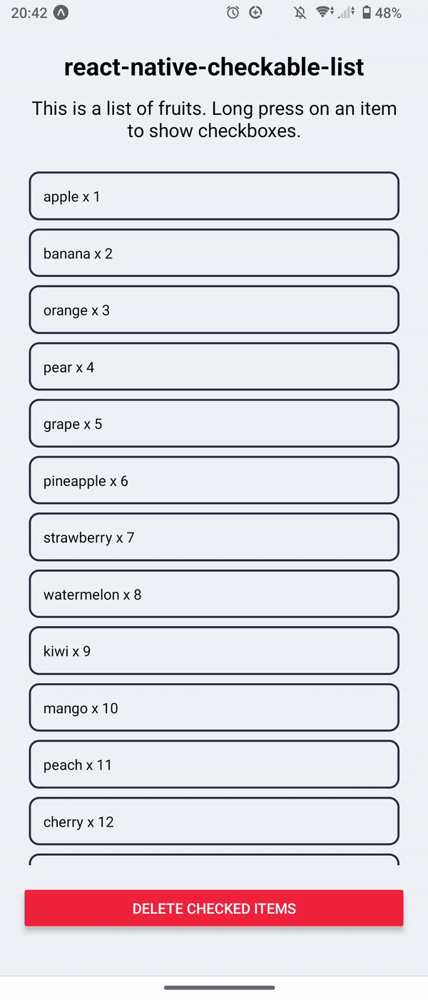

# react-native-checkable-list

react native checkable list

## Demo



## Installation

```sh
# npm
npm install react-native-checkable-list

# yarn
yarn add react-native-checkable-list
```

## Usage

```jsx
import CheckableList, { useCheckedItems } from 'react-native-checkable-list';

export default function App() {
  const [items, setItems] = React.useState<{ name: string; amount: number }[]>([
    { name: 'apple', amount: 1 },
    { name: 'banana', amount: 2 },
    { name: 'orange', amount: 3 },
  ]);

  const { checkedItems, setCheckedItems } = useCheckedItems();

  return (
    <View>
      <CheckableList
        items={items}
        keyExtractor={(item) => item.name}
        renderItem={(item) => (
          <View>
            <Text>
              {item.name} x {item.amount}
            </Text>
          </View>
        )}
        onPressItem={(item) => {
          console.log('onPressItem', item.name);
        }}
        canCheckItem={(item) => item.name !== 'banana'}
        checkedItems={checkedItems}
        setCheckedItems={setCheckedItems}
      />
    </View>
  );
}
```

## Contributing

See the [contributing guide](CONTRIBUTING.md) to learn how to contribute to the repository and the development workflow.

## License

MIT

---

Made with [create-react-native-library](https://github.com/callstack/react-native-builder-bob)
